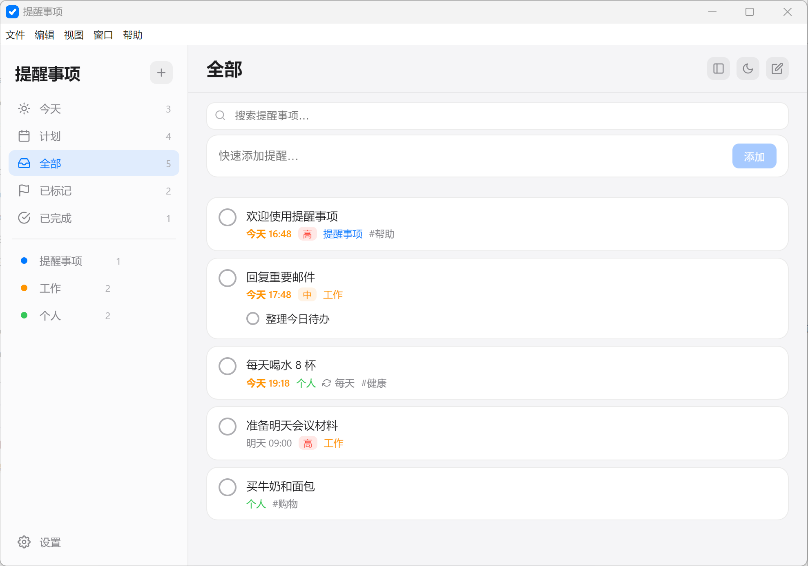
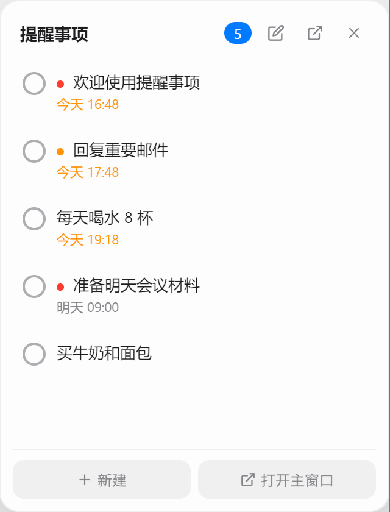

# 提醒事项 (Reminders)

一款轻量级桌面待办提醒应用，类似 Apple 提醒事项。支持悬浮小窗、系统通知、自定义分类、重复提醒、全局快捷键。

## 功能特色

- **分类管理** — 预设分类（今天、计划、全部、已标记、已完成）+ 自定义清单（支持颜色）
- **悬浮小窗** — 主窗口关闭后自动弹出，置顶显示最近事项，支持内联新建
- **系统通知** — 到点 Windows 原生通知提醒，点击跳转对应事项
- **重复提醒** — 每天/工作日/每周/每月/每年，完成自动生成下一次
- **子任务 & 标签 & 优先级** — 事项详情支持子任务、标签、高中低优先级
- **深色/浅色主题** — 切换主题，跟随系统原生标题栏
- **全局快捷键** — 自定义快捷键快速开关主窗口和悬浮窗
- **数据安全** — 本地 JSON 文件存储，原子写入 + 自动备份，数据不丢失

## 截图

| 主窗口 | 悬浮窗 |
|--------|--------|
|  |  |

## 快速开始

```bash
# 安装依赖
npm install

# 复制 Vue 构建文件
cp node_modules/vue/dist/vue.global.prod.js src/renderer/lib/

# 开发模式运行
npm run dev

# 生产模式运行
npm start

# 打包为 Windows 安装程序
npm run build
```

## 依赖

- [Electron](https://www.electronjs.org/) — 桌面应用框架
- [Vue 3](https://vuejs.org/) — 前端框架
- [electron-builder](https://www.electron.build/) — 打包工具

## 项目结构

```
reminders-app/
├── src/
│   ├── main/            # Electron 主进程
│   │   ├── index.js     # 窗口、托盘、IPC、菜单
│   │   ├── store.js     # 数据层 (JSON 存储)
│   │   ├── notify.js    # 通知调度
│   │   ├── tray-icon.js # 托盘图标生成
│   │   ├── preload.js   # 主窗口预加载
│   │   └── preload-float.js  # 悬浮窗预加载
│   └── renderer/        # 渲染进程
│       ├── index.html   # 主窗口
│       ├── float.html   # 悬浮窗
│       ├── js/          # Vue 应用逻辑
│       └── css/         # 样式
├── build/               # 图标生成
├── package.json
└── README.md
```

## 打包产物

- `release/提醒事项 Setup 2.0.0.exe` — NSIS 安装包
- `release/提醒事项 2.0.0.exe` — 免安装版

## 协议

MIT